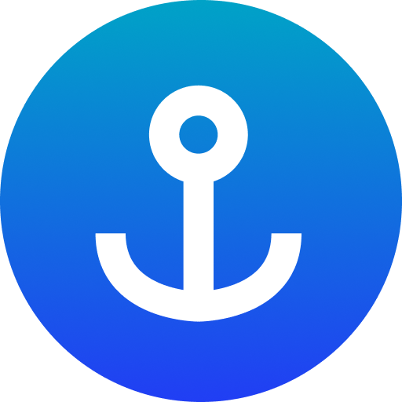

<div><p align="right">
    <h1>Good Morning! I'm Brandon Robb &nbsp;&nbsp;&nbsp;&nbsp;&nbsp;Welcome to my Github</h1>
</p></div>


<h2>
    I'm aspiring software developer with a military background in aviation maintenance, currently a junior at <a
        href="https://auburn.edu/">Auburn University</a> pursuing a Bachelor of Computer Science with a graduation date
    of August 2025
</h2>

<div style="display: flex; justify-content: space-between; align-items: left">
    <a href="https://www.linkedin.com/in/Brobb954/">
        
    </a>
    <a href="https://github.com/Brobb954">
        
    </a>
    <a href="mailto:bar0086@auburn.edu">
        
    </a>
</div>

<br clear="right"/>

```Rust
struct Applicant {
    name: String,
    college_level: String,
    education: String,
}

fn applyForInternship(applicant: &Applicant) -> String {
    Let internship = "Software Developer";
    Let company = "Your Company";
    Let location = "Remote";
    Let duration = "Any";
    format!("Applying {} for a {} internship at {} ({}) for {} months", applicant.name, internship, company, location, duration);

    if company.is_hiring() && applicant.is_qualified() {
        return "You're hired!";
    } else {
        return "Sorry! Try again another time.";
    }
}

fn main() {
    let me = Applicant {
        name: String::from("Brandon Robb"),
        college_level: String::from("Junior"),
        education: "Pursuing a B.S. in Computer Science".to_string(),
    };

    let application_status = applyForInternship(&me);
    println!("{}", application_status);
}
```

<p style="font-size: 16px">
<h2>Military Service:</h2> <br>
<div style="font-size: 24px">
</div>

<div style="display: flex; justify-content: space-between; align-items: center;">
    <h2><span>Languages Learned:</h2></span>
    <h2><span>Languages Learning:</h2></span>
</div>
<div style="display: flex; justify-content: space-between; align-items: center;">
    <span>
        <a href="https://docs.oracle.com/en/java/index.html">
            
        </a>
        <a href="https://git-scm.com/">
            
        </a>
        <a href="https://developer.mozilla.org/en-US/docs/Web/HTML">
            
        </a>
        <a href="https://www.python.org/">
            
        </a></span>
    <span>
        <a href="https://developer.mozilla.org/en-US/docs/Web/JavaScript">
            
        </a>
        <a href="https://docs.rs/">
            
        </a>
        <a href="https://www.typescriptlang.org/">
            
        </a>
    </span>
</div>
<h2> Tech Stacks:</h2>
<a href="https://www.anchor-lang.com/">
    
</a>
<a href="https://www.docker.com/">
    
</a>
<a href="https://www.docker.com/">
    
</a>
<a href="https://github.com/Brobb954">
    
</a>
<a href="https://www.npmjs.com/">
    
</a>
<a href="https://pnpm.io/">
    
</a>
<a href="https://www.postgresql.org/">
    
</a>
<a href="https://react.dev/">
    
</a>
<a href="https://tauri.app/">
    
</a>
<a href="https://code.visualstudio.com/">
    
</a>
<a href="https://yarnpkg.com/">
    
</a>
<h2>Certifications and Licenses:</h2>
<a href="https://www.coursera.org/professional-certificates/google-data-analytics">
    
</a>
</a>
<a href="https://www.faa.gov/pilots/become">
    
</a>
<a href="https://www.coursera.org/specializations/rust-programming">
    
</a>
<a href="https://www.faa.gov/mechanics/become">
    
</a>
<br><br>

<h2> Projects</h2>
<ul>
    <li> <a href="https://github.com/Brobb954/simple_budget">Simple Budget It</a></li>
    <ul>
        <li>Created to be a budgeting app that is simple to use but packed with robust features. It is currently
            functional in python but I am in the process of converting it to a Tauri app which uses a rust back end and
            a react front end.</li>
        <li> Right now it simply tracks income and expenses inputed by the user in a excel spreadsheet, with the upgrade
            to Tauri it will rely on a postgres database for more efficent data storage and retrival. I will also be
            looking to implement a multiple budget, interface to be able to use it for forcasting months in advance or
            tracking budget overtime, I would also like to create charts to show trends. </li>
    </ul>
    <li><a href="https://github.com/TrustRent/anchor-backend">Trust Rent</a></li>
    <ul>
        <li>TrustRent is a cutting-edge web application designed for the Solana network, leveraging the speed and
            transparency of blockchain to transform the rental market. The TrustRent platform is built with the aim of
            optimizing rent payments and security deposit management, guaranteeing instant transactions, yielding
            financial benefits, and fostering trust between tenants and landlords.</li>
        <li>My role in this project was to create the backend using Anchor, a rust based framework for Solana, to create
            the smart contracts that would handle the transactions between the tenants and landlords. I also created the
            database schema and the API endpoints that would be used by the front end to interact with the smart
            contracts.</li>
    </ul>

</ul>
<!-- <b>Passionate Learner:</b> Always eager to learn new technologies and apply them to real-world problems.
</p> -->
</div>


<!--****
**Brobb954/Brobb954** is a ✨ _special_ ✨ repository **because** its `README.md` (this file) appears on your GitHub profile.

Here are some ideas to get you started:

- 🔭 I’m currently working on ...
- 🌱 I’m currently learning ...
- 👯 I’m looking to collaborate on ...
- 🤔 I’m looking for help with ...
- 💬 Ask me about ...
- 📫 How to reach me: ...
- 😄 Pronouns: ...
- ⚡ Fun fact: ...
-->
